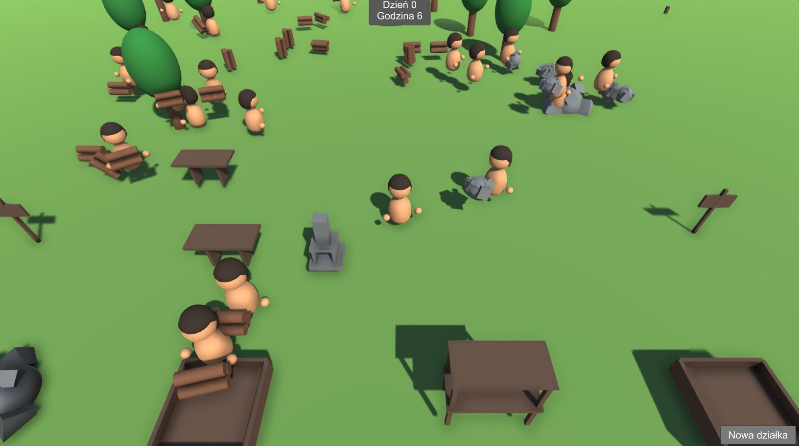
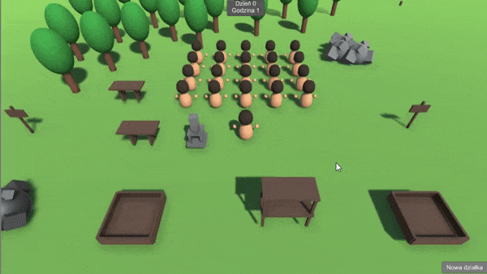
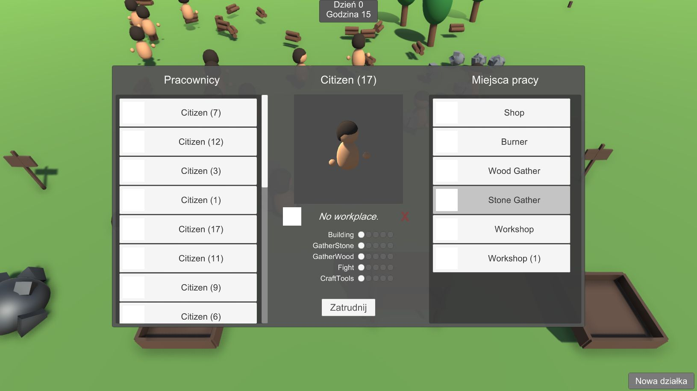
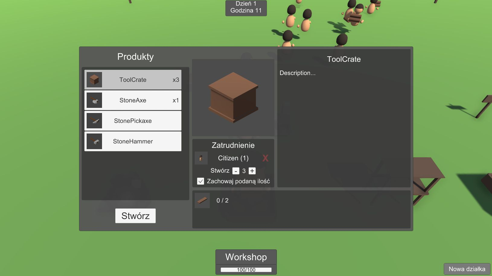
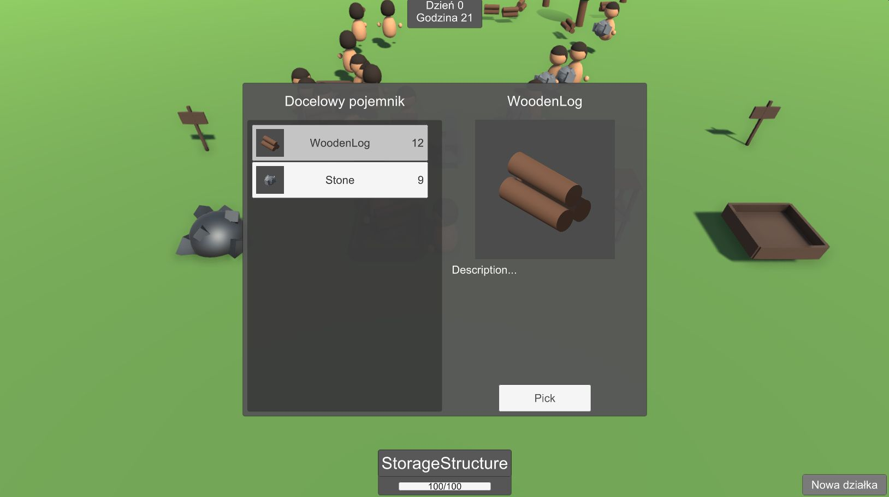

# Craftopoly
</img>

## Note
[**Go to my C# scripts**](Assets/Scripts)

## Game settings
### Camera
Perspective top-down, following Player position, fixed rotation.
### World
Flat, empty terrain with some test objects.
### Player
Simple character with horizontal movement (WSAD or LStick).

## Implemented features
### Player and NPC
- gathering items from sources (trees, rocks)
- carrying items (wood, stone, ore, tools, crates)
- crafting items (boards, tools, crates)
- 
skills affecting speed of different actions

### Player
- consuming (crates ;) )
- attaching tool to belt

### Player (UI)
</img>
- 
assigning NPCs to workplaces (structures)

- 
setting crafting items and counts

- 
viewing storage items

- selling/buying
- creating new plots for structures

### NPC
- executing tasks provided by assigned workplace (behavior trees with [Behavior Designer](https://assetstore.unity.com/packages/tools/visual-scripting/behavior-designer-behavior-trees-for-everyone-15277) )
</img>

### Other
- keyboard + mouse / controller support
- input hints
- simple localizations
- notifications about missing items needed for crafting
