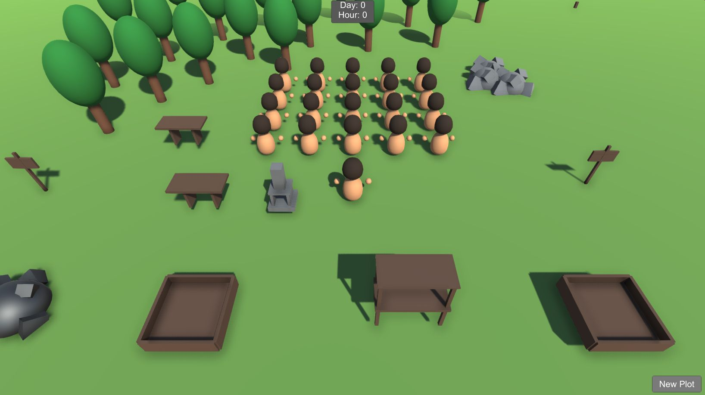
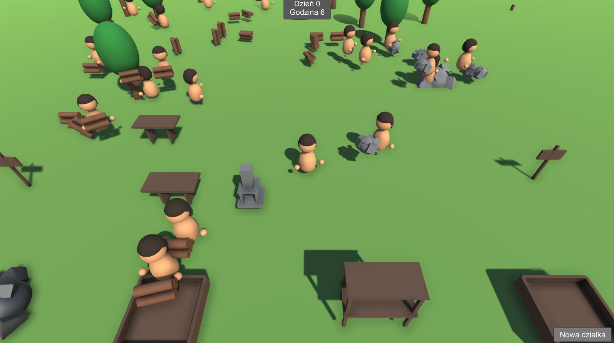
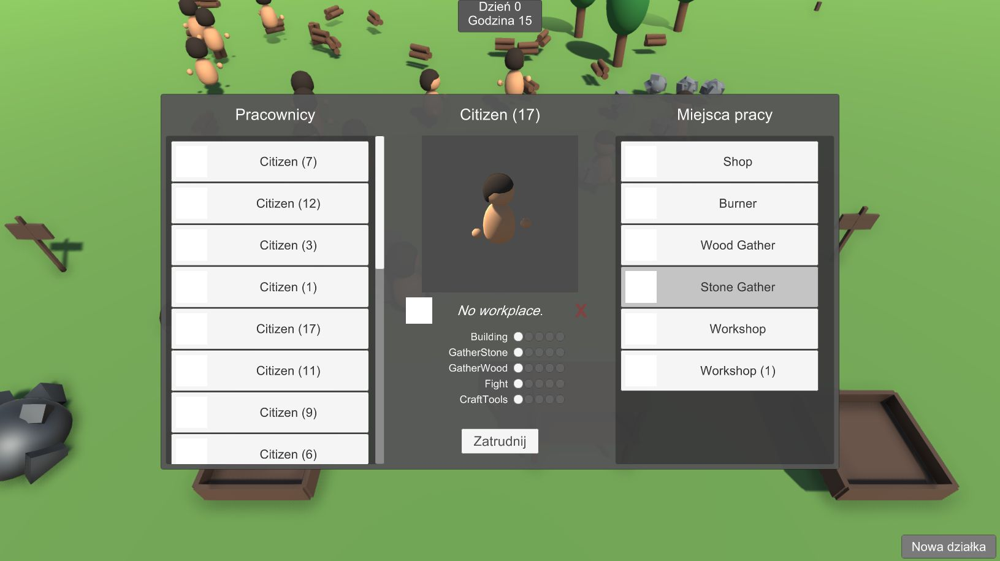
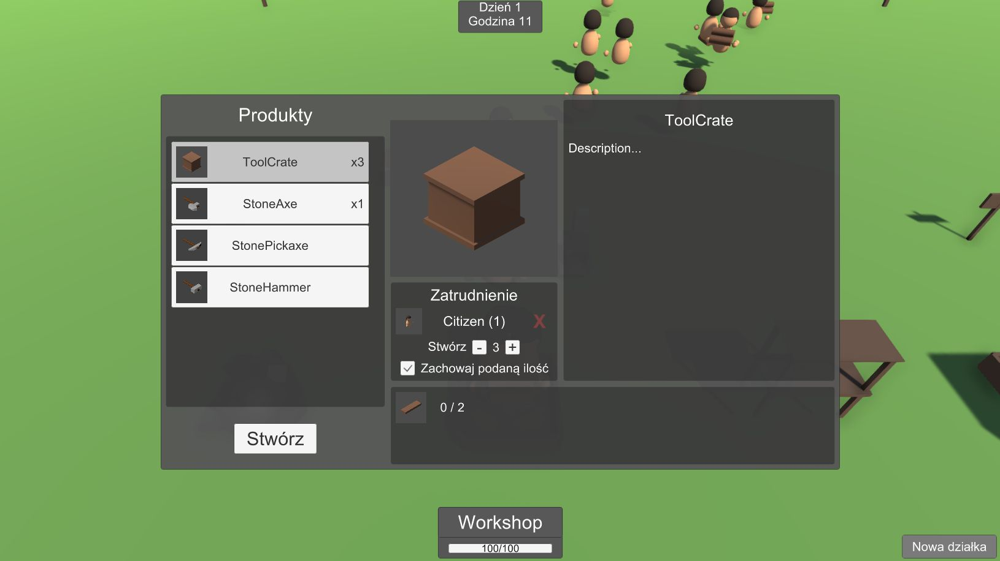
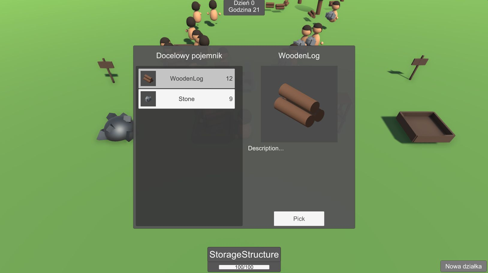
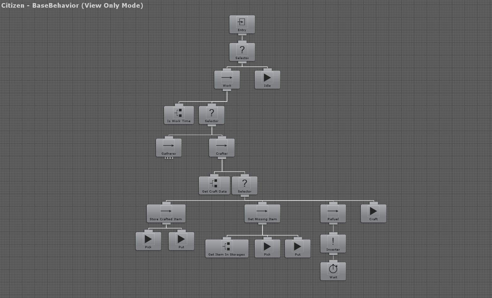

# Craftopoly
</img>

## Game settings
### Camera
Perspective top-down, following Player position, fixed rotation.
### World
Flat, empty terrain with some test objects.
### Player
Simple character with horizontal movement (WSAD or LStick).

## Implemented features
### Player and NPC
</img>
- gathering items from sources (trees, rocks)
- carrying items (wood, stone, ore, tools, crates)
- crafting items (boards, tools, crates)
- skills affecting speed of different actions

### Player
- consuming (crates ;) )
- attaching tool to belt

### Player (UI)
</img>
- assigning NPCs to workplaces (structures)
</img>
- setting crafting items and counts
</img>
- viewing storage items
- selling/buying
- creating new plots for structures

### NPC
</img>
- executing tasks provided by assigned workplace (beahviour trees at first, but then implemented own system for simple tasks lists)

### Other
- keyboard + mouse / controller support
- input hints
- simple localizations
- notifications about missing items needed for crafting

## Note
[implementing-tasks](../../tree/implementing-tasks) is the most up to date branch
